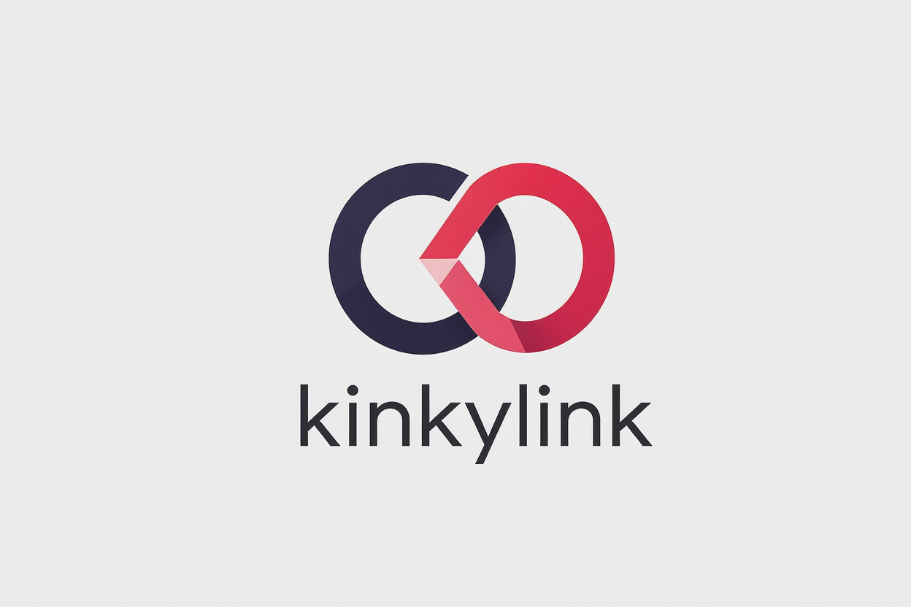

# kinkylink Brand Guidelines

## **About**
kinkylink provides premium, frictionless link-management tools designed for a community focused on side hustles and boosting overall income. It serves as a vital component within a broader ecosystem of growth-focused resources, integrating seamlessly alongside the self-publish toolkit and dividend calendar.

---

## **Logos & Marks**

* **Primary Mark:** 

*(Note: Ensure the `kinklink_logo.png` file is placed in the same directory as this markdown file for the image to render correctly).*

---

## **Color Guide**

The brand's color identity is organized by role: the primary anchors the brand, secondary and accent colors provide expressive range, and surface and text colors define the foundation for legible, on-brand layouts.

### **Brand Palette**

| Role | Color Name | HEX Code | RGB | Usage Notes |
| :--- | :--- | :--- | :--- | :--- |
| **Primary** | Placebo Sky | `#ECFBFD` | 236, 251, 253 | Appears in primary CTAs and bright highlighting. |
| **Secondary** | Floppy Disk | `#140044` | 20, 0, 68 | The foundational brand color, used for the smooth ring in the logo and solid structure. |
| **Accent** | Red Flag | `#FF224B` | 255, 34, 75 | The "kink." Highlights inflection points, upward momentum, and energetic elements. |
| **Surface** | Off White | `#EDEEEF` | 237, 238, 239 | Backgrounds and app surfaces to keep the ui clean. |
| **Text** | Black | `#000000` | 0, 0, 0 | Primary typography and the wordmark. |

### **Supporting Colors**
*Useful as tints, charts, or backup accents for dashboard data.*

* **Tropical Pool:** `#BEDEF4` (RGB 190, 222, 244)
* **Uniform:** `#A9B7CB` (RGB 169, 183, 203)
* **Jordy Blue:** `#79ACE9` (RGB 121, 172, 233)
* **Feather Star:** `#609EF7` (RGB 96, 158, 247)
* **Slice of Heaven:** `#0026F2` (RGB 0, 38, 242)
* **Singapore Orchid:** `#A923E9` (RGB 169, 35, 233)
* **Pink Insanity:** `#D042F0` (RGB 208, 66, 240)
* **Light Periwinkle:** `#C7C5F5` (RGB 199, 197, 245)
* **White:** `#FEFEFE` (RGB 254, 254, 254)
* **Off White (Variant):** `#DCDDDE` (RGB 220, 221, 222)
* **Light Grey:** `#CCCCCD` (RGB 204, 204, 205)
* **Grey (Medium):** `#999999` (RGB 153, 153, 153)
* **Grey (Dark):** `#777777` (RGB 119, 119, 119)
* **Dark Grey:** `#575858` (RGB 87, 88, 88)

---

## **Typography**

### **Brand Typefaces**
* **Display Typeface:** Calibre Thin (Used for the primary wordmark, headlines, and display text).
* **Body Typeface:** Calibre Light (Used for paragraphs and UI).

### **Type Scale**

| Level | Size | Example Use Case |
| :--- | :--- | :--- |
| **DISPLAY** | 48 px | Where headlines feel powerful |
| **H1** | 40 px | Shaping the brand voice |
| **H2** | 32 px | Section titles & key callouts |
| **H3** | 24 px | Subheads and feature copy |
| **Body** | 16 px | The everyday paragraph weight your readers will spend the most time with. |
| **Caption** | 12 px | Small notes, metadata, footnotes. |